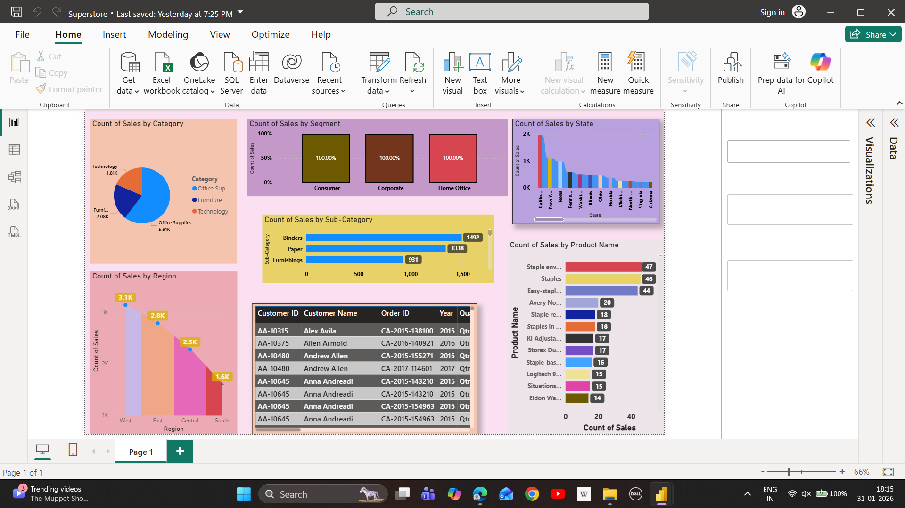

# 📊 Superstore Sales Analytics – Power BI Dashboard

## 🚀 Project Overview
This project presents an *interactive Power BI dashboard* developed using the *Superstore Sales dataset* to analyze business performance across regions, categories, customer segments, and products.  
The dashboard is designed to help stakeholders make *data-driven decisions* by transforming raw sales data into meaningful insights.

---

## 🎯 Business Objectives
- Analyze sales distribution across regions and states  
- Identify top-performing product categories and sub-categories  
- Understand customer segment behavior  
- Track product-level sales frequency  
- Support strategic and operational decision-making  

---

## 📌 Key Insights
- Region-wise sales comparison (West, East, Central, South)  
- Category contribution analysis (Office Supplies, Furniture, Technology)  
- Sub-category sales performance  
- Segment-wise sales share (Consumer, Corporate, Home Office)  
- State-wise sales trends  
- Top-selling products by sales count  

---

## 📈 Dashboard Features
- Interactive filters and slicers  
- Clean and professional visual layout  
- KPI-focused charts for quick analysis  
- Business-friendly color themes  
- Drill-down ready visuals  

---

## 🛠 Tools & Technologies
- *Power BI Desktop* – Data visualization and modeling  
- *Excel / CSV* – Data source  
- *DAX* – Measures and calculations  
- *GitHub* – Version control and documentation  

---

## 📂 Project Structure

Superstore-Sales-PowerBI-Dashboard/ │ ├── dashboard/ │   └── Superstore_Sales_Dashboard.pbix │ ├── dataset/ │   └── superstore_sales_data.csv │ ├── images/ │   ├── overview.png │   ├── category_analysis.png │   ├── regional_sales.png │ ├── README.md └── LICENSE

## 🖼 Dashboard Preview
  

---

## 💡 Business Use Cases
- Retail sales performance tracking  
- Market and regional analysis  
- Product demand analysis  
- Customer segmentation insights  
- Executive-level reporting  

---

## ▶ How to Use
1. Download the .pbix file from the *dashboard* folder  
2. Open it using *Power BI Desktop*  
3. Load or refresh the dataset if required  
4. Use slicers and visuals to explore insights  

---

## 📜 License
This project is licensed under the *MIT License*.

---

## 👤 Author
*Rahul Kumar*  
Aspiring Data Analyst | Power BI | SQL | Excel  
Focused on transforming data into actionable business insights.
